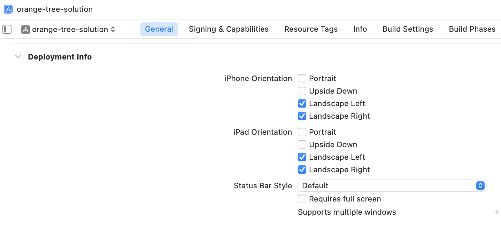
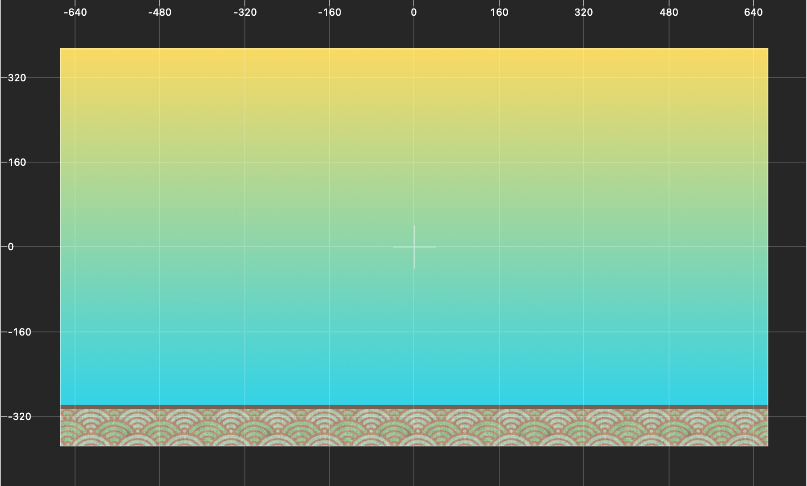
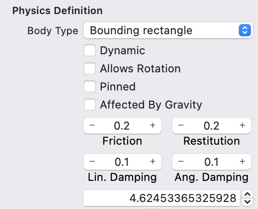
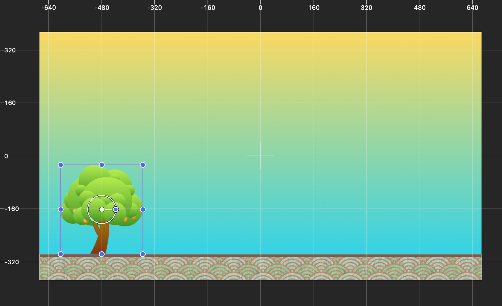

# Setting the Scene

I'm sure you are excited to start flinging oranges around, I mean who wouldn't want to fling 'em!
Before you can do that though, you need to set up the scene and get some basic assets in place.

> [action] Start by removing the `Actions.sks` file. Select it in the file tree and press Delete and choose move to trash. 

Great! Now time to do some configuration of the scene. Orange Tree will be played in
*landscape* mode, just like Angry Birds. You need to change a setting in our project file
to ensure the game does not try and run in *portrait* mode by mistake.

> [action] Open the project file (the top one in your project tree). Go to the General Tab and scroll to *Deployment Info* and uncheck the *portrait* setting under *Device Orientation*. Your *Deployment Info* section should now look like this.

Now that your project will only run in *landscape*, open the *GameScene.sks* file so that
you can finish the setup.

> [action] Open `GameScene.sks` and start by deleting the default `helloLabel` node. The object tree for the *GameScene* should now be empty. Next, select the *Scene* object at the top of the object heirarchy and click the *Attributes Inspector*. The default settings are set for portrait mode, change that by setting the *width* to `1334` and the *height* to `750`. You should also change the *Anchor Point* to `x:0.5`, `y:0.5`.

# Your First Assets

Right now the scene is looking boring. Luckily, you can change that pretty quickly
since you already have some assets that were provided for you. You are going to set up the
background and the 'player', aka the orange tree, by placing them in the scene.

> [action]
> In the project navigator on the left, open `Smashing-Things`. Look for an image named
> `background.png` and drag it into the scene. Make sure that you center it inside the white
> viewable area rectangle. It should snap into place. Check the position in the attribute inspector is set to
> `x:0`, `y:0`, set the *Name* to `background`, and set the *`Z` Position* to `-2`. Z position arranges objects from to back. Higher numbers are in front. 

> Now grab the image named `Ground.png` and drag it into the scene. Snap it to the bottom of the view so
> that it is centered. Check that the position is set to `x:0`, `y:-336` and then set the *Name*
> property to `ground`. If everything went well, your scene should now look like this.
> 

# Getting Down to Earth

Now that you have some basic assets in the scene, you need to configure some special settings. 
If you have ever played the game Angry Birds, you know that the objects in the game interact
with each other like they would in real life. When objects hit each other, mainly when the
birds fly into objects, they get knocked over and can bump into each other.

You might be asking yourself at this point, how in the world you are going to be able to
simulate real physics like those games! Don't worry, Apple has already done this for you
and it is part of the SpriteKit framework! Three cheers for Apple, woohoo!

> [info]
> If you want to know more about the physics engine in SpriteKit, this 
> [link](https://medium.com/@jjacobson/spritekit-physics-14331398b308) is a good place to
> start. You may have also seen a setting on the *Scene* object called *Gravity* that has a
> value of `-9.8` for the *y* value. If you have taken a physics class, this value should be
> familiar as it is the constant for gravity here on earth, 9.8 meters per second. The negative
> indicates that it is down on the *Y Axis*, just think of it as down towards the bottom of the
> screen for now.
> 

Alright, so you don't need to make a physics engine. But what do you need to do to make
your objects interact with each other? For starters, if you run the game right now you will
notice that not a whole lot happens. Let's change that and see the magic of this built in
physics engine!

NOTE! When testing your project you use Device > Orientation to rotate the simulator. 

> [action]
> Open *GameScene.sks* and click on the *ground* "node" in the object tree. Make sure you are
> looking at the *Attributes Inspector* window. Locate the *Physics Definition* section, you
> may need to scroll down, and set the *Body Type* to `Bounding Rectangle`. You may have
> noticed a bunch of properties just became available. For now you are going to leave all the
> settings how they are. Now, run the game using the `CMD+R` shortcut.

Woah! What happened to your *ground* node? It's almost as if gravity pulled it out of the scene!

The ground should fall down off the bottom of the screen as the gravity affects it!

> [challenge]
> Take a look at the settings for the *ground* node's physics body and see if you can figure
> out how to prevent the node from sinking through the bottom of the scene.

-
-
-
-
-
-
-
-
-
-
-
-
-
-
-
-
-
-
-
-
-
-

> [solution]
> The setting that you want to make sure that you turn off is called *Affected By Gravity*.
> Unchecking that box should make sure that your ground node does not go flying off in to the
> unknown.
> 

If you run the game now, you should see that your *ground* node no longer falls off the
bottom of the screen! To make sure that the *ground* node stays in place when other objects
collide you need to change two more settings. These settings will be discussed in further
detail later in the tutorial, so don't worry if you don't understand what they mean now.

> [action]
> Locate the *Physics Definiton* settings and uncheck *Dynamic* and *Allows Rotation*. Very
> briefly, the *Dynamic* setting tells the physics engine whether or not this node will move
> or whether it will be static. The *Allows Rotation* setting tells the engine whether or not
> the node can rotate. In shprt, the ground should not move when other objects hit it, and it should not rotate either! 
>
> Check that your *Physics Definiton* matches the picture below before moving on.
> 

<!-- -->

> [info]
> Before we move on to the last step, I wanted to point out that there are many more settings 
> in the *Physics Definition*. You are going to leave them as they are for
> now. If you want to find out more about them, I encourage you to do some reading in the
> [documentation](https://developer.apple.com/documentation/spritekit) to learn more about it.

# Putting the Tree in Orange Tree

The last step for this section will be adding the Orange Tree!

> [action]
> Locate *OrangeTree.png* in the *assets.atlas* folder and drag it into the scene. It should
> snap to the top of the *ground* node. It should snap into place at `x:-480` ,`y:-162`. This looks
> like a perfect place for the tree! The last thing to do is set the *Z Position* to `-1` and
> the *Name* to `tree`. Run your project and check that it looks like the image below.
> 

# Summary

Awesome! We now have our scene set so that we can start flinging some citrus :]

In this section you learned about:

- The physics engine built in to *SpriteKit*
- How to make objects interact with the physics engine

<!-- Expand this more? Seems a little short on topics learned -->

In the next section we are going to start making that citrus fly!
