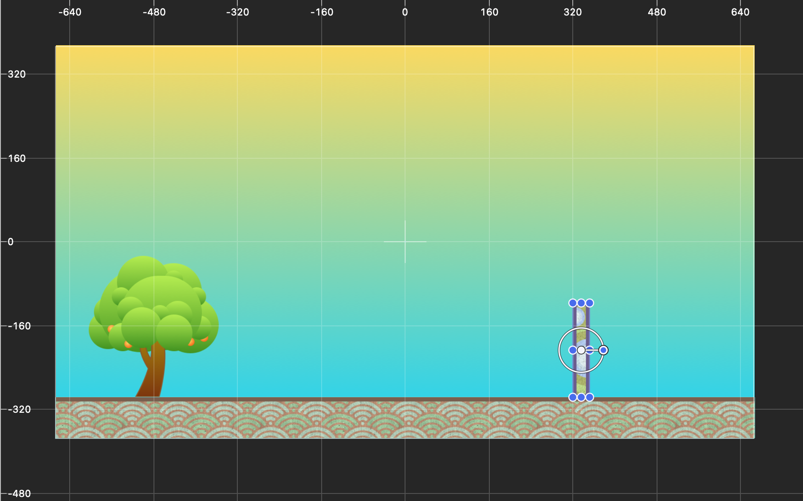
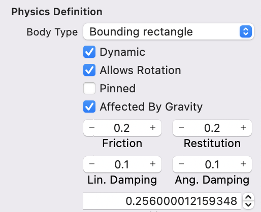
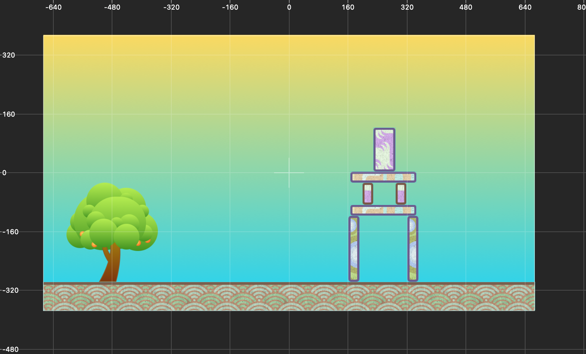
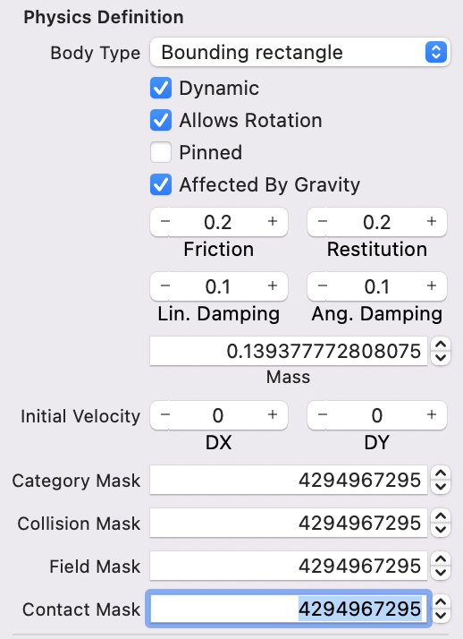

# Level the Playing Field

Looking at the current state of the game, it is possible to create and fling oranges around the screen. At this point though, the game is kind of boring. It would be much more fun, and more like Angry Birds, if there were some structures we could throw those oranges at. Let's add some blocks now and learn more about the physics engine!

> [action] Open *GameScene.sks* and locate the file in *assets.atlas* named `rectangle-1-120x20.png` and drag it into the scene amd position it opposite the tree. 



> Now to make sure that the orange can collide with it, locate the *Physics Definition* section in the *Attributes Inspector* and give it a `Bounding Rectangle` for the *Body Type*. In this case, you want to leave the default settings so that it is affected by gravity, can rotate, and is dynamic.



Go ahead and run your game and fling an orange at that block! Pretty cool, huh? Let's take a moment to discuss the *Dynamic* and *Allows Rotation* properties. In the last section, it was mentioned the *Dynamic* property is what tells the physics engine whether or not the node is static, meaning it won't move, or whether it can move and interact with other physics bodies.

Before diving into that more, let's do a little experiment.

> [challenge] What do you think is going to happen if you turn off the *Dynamic* property and hit the block with an Orange? Take a guess and then go ahead and turn off *Dynamic* and give it a try.

-
-
-
-
-
-
-
-
-
-
-
-
-
-
-
-
-
-
-
-

<!-- -->

> [solution] If you guessed that the orange would hit the block and bounce back, you're right! When a node is *Static* (not *Dynamic*) it means that the node will not move, but because it has a physics body, other nodes can still collide with it.
>
> There is also one more important topic concerning *Static* versus *Dynamic*. When the physics engine is calculating changes for nodes, it has to keep track of changes for **every** node that is *Dynamic*. If you know for sure that you need a node to interact with the physics engine and that it won't be moving, turn off the *Dynamic* property. This can give you a good performance boost as the physics engine doesn't need to examine the node for location changes.

Okay, so experiment one down. You now know how to make nodes in the scene *Static* or *Dynamic* and why you should turn off *Dynamic* if you don't need it. Let's do one more quick experiment with the *Allows Rotation* property.

> [challenge] Before you begin this challenge, make sure to set *Dynamic* on again for the block. Now, what do you think is going to happen when you turn off *Allows Rotation* and fling an orange at the block? Take a second to consider it and then give it a shot!

-
-
-
-
-
-
-
-
-
-
-
-
-
-
-
-
-
-
-
-
-
-

<!-- -->

> [solution] If you guessed that the block would get pushed back without toppling over, you got it right! When a node is not allowed to rotate, it can only be pushed around by other nodes. This isn't really the behavior that you want for your game though, so make sure to turn *Allows Rotation* back on before moving on.

# Building a Tower

In this next section, you are going to build up a tower to make this game a little more fun! Knocking one block over is cool, for maybe 10 seconds. If you want to copy a block that is already in the scene, you can click on it and hit `CMD+D` to duplicate it and move it around. Using that trick will help you to copy the settings
of the block around (including your *Physics Definition*).

> [action] Take a moment now to add some more blocks and build out a tower! The picture below is just one way to put together some blocks to make a tower.



Once you have built your tower, have a little fun and knock it down!

# Making a Goal

Your game is starting to look better and the core mechanic of the game is almost complete! You can fire oranges at blocks that you have placed in the scene. But, something is missing. If you think back to Angry Birds, how does a player win a level? They win by hitting those smug piggies! You need some kind of goal for the player to aim for in your levels. Let's add one now.

> [action] Locate *Skull.png* in the assets for the game and drag it on to the scene. Place the skull somewhere in your tower that will make it a challenge for the player to knock it down. 

The *Skull* that you just added to your level is going to be the goal for the player. You want them to knock the tower over and destroy the *Skull*. If you run your game now, you will notice that the skull is going to act just like the other blocks. If you hit it, it will get knocked around and nothing else happens. What you really want to happen is for the skull to disappear if it gets hit hard enough.

To make this magic happen, first you to need to get the *Skull* ready!

> [action] Click on the skull in the node heirarchy on the left hand side. Set the *Name* property to `skull` and locate the *Physics Definition*. Give the *Skull* a `Bounding Rectangle` for the *Body Type* and locate the setting called *Contact Mask* (you may need to scroll down). You want this setting to be equal to `4294967295`. The easiest way to do this is to click the down arrow next to the number. Your *Skull* is now ready to handle collisions!



I'm sure you are wondering what the heck a *Contact Mask* is, so let's talk about it breifly. The physics engine uses *Masks* to help it understand what nodes can interact with each other. But wait, doesn't the *PhysicsBody* handle that? Not quite, the *PhysicsBody* allows a node to interact with the physics engine, but it does not determine if nodes can collide or interact with each other.

Take a look at the below picture that shows the *Masks* in the *Physics Definition* for your *ground* node.  As you can see, some of the *Masks* already have values in them. These values are set by default when you add the physics body to the node. 

<!-- TODO: Better explanation of bitmasks -->

Those numbers correspond to binary values that can be thought of as gates. This topic is advanced, so let's use a very simplified example.

Under the hood, these *Masks* are actually *Bitmasks*, which means they are used as binary numbers and can be used
to do binary math. Assuming the *ground* node and one of the *block* nodes has the same values in their
mask, they can collide or interact.

```Swift
ground_mask = 0001
block_mask  = 0001
```

They can interact because they both have a `1` in the last slot. But what would happen if they did not share
a common 'gate'.

```Swift
ground_mask = 0010
block_mask  = 0001
```

In this case, they can not interact with each other because the physics engine will see that they do not share a bit in the same column. Again, this is a very over simplified example of what is going on. Let's take a look at how this works in your scene.

<!-- End of TODO: -->

> [action] Click on the *ground* node and under the *Physics Definition* locate the *Category Mask*. Click the up arrow so that the number is now `0`. Now run your game and see what happens. 

Wow! Your tower just fell through the bottom of the level right! Your tower fell through because when you changed the *Category Mask* to `0`, you told the physics engine that the *ground* node should not interact with any other nodes. In binary numbers `0` is `0000` and there are no `1` bits anywhere. Nothing will collide with this! 

Make sure to reset the *Category Mask* before moving on!

# Creating Contact

At this point everything is almost set up to be able to destroy those pesky skulls! You have set up your *Skull* so that the physics engine knows when it will collide with other objects, now you need to write the code in your *GameScene* file to handle this.

> [action] Open *GameScene.swift* and at the bottom of the file, outside of the *GameScene* class add the following:

```Swift
extension GameScene: SKPhysicsContactDelegate {
  // Called when the physicsWorld detects two nodes colliding
  func didBegin(_ contact: SKPhysicsContact) {
    let nodeA = contact.bodyA.node
    let nodeB = contact.bodyB.node

    // Check that the bodies collided hard enough
    if contact.collisionImpulse > 15 {
      if nodeA?.name == "skull" {
        removeSkull(node: nodeA!)
      } else if nodeB?.name == "skull" {
        removeSkull(node: nodeB!)
      }
    }
  }

  // Function used to remove the Skull node from the scene
  func removeSkull(node: SKNode) {
    node.removeFromParent()
  }
}
```
>

*Class Extensions* are used in Swift to extend the functionality of a class. They are also a great way to organize your code into more readable, manageable chunks! Because you are extending the *GameScene* class to be an *SKPhysicsContactDelegate*, it makes sense to move this code into an extension that encapsualtes just this functionality. When conforming to protocols, it is common to use *Extensions* to keep the related code together.

Inside the extension, you use the *didBegin(_ contact: SKPhysicsContact)* method to handle the event when two *PhysicsBodies* collide. The *Category Mask* and the *Collision Mask* must both be the same on both nodes for them to interact and cause a *Contact Collision*. Inside the method, you check to see if the collision was hard enough to remove a node. If it is, you then check that one of the nodes was a *Skull* and if so, remove it from the scene.

If you were to run your game right now you would see that nothing happens when your *Skull* gets hit. See
if you can take a guess as to why it won't work. A small hint, you conformed to be the delegate for the *SKPhysicsContact* method.

> [action] If you were thinking that you haven't set up the delegate yet then you were correct! You have conformed your scene so that it can receive those notifications, but you still need to set the contact delegate of the *Physics World* in your scene.
>
> In *GameScene.swift* at the bottom of the *didMove(to:)* function add the following code:

```Swift
// Set the contact delegate
physicsWorld.contactDelegate = self
```
>

Go ahead and run your code now and see if you can make your *Skull* disappear!

# Summary

Aweome job! In this section you learned how to:

- Make nodes interact with the physics engine
- Handle collisons between two nodes
- Use *Class Extensions* in Swift
- Build up a level using *sks* files

In the next section you are going to learn how to improve your scene, the gameplay mechanic, and
how to make and load a different level!