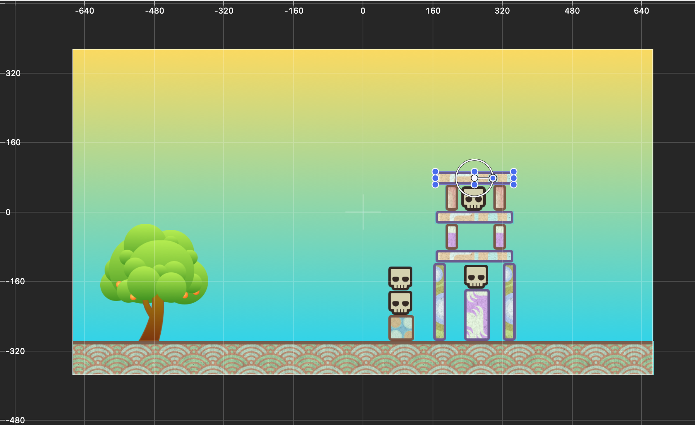

# Improving the Scene

In this section you are going to make some improvements to the scene. After you have made some improvements, you are going to learn how to make a second level. Being able to create multiple levels is important if you want to make a game that people want to play. A single level would not be very fun if that was the whole game!

# Making Improvements

Right now, if you play the game, you may have noticed that when you fling the oranges, they go **really** fast across the screen. You are going to fix this by dampening the vector that you created in the *Flying Fruit* section.

> [action] Open *GameScene.swift* and locate the *touchesEnded* function. Replace the two lines where you set `dx` and `dy` with the following lines:

```Swift
// Old code Replace
let dx = touchStart.x - location.x
let dy = touchStart.y - location.y

// With New code
let dx = (touchStart.x - location.x) * 0.5
let dy = (touchStart.y - location.y) * 0.5
```

Run your game and you should see that the oranges now fly at a more reasonable speed. If you don't like the speed, feel free to tweak the number and maybe turn the speed up a bit more! The beauty of making changes like this is that they are very easy to tweak to the way that you want without much trouble.

# Wait... Where did the Oranges Go?

As you were playing with your game, you may have also noticed that the oranges fly off the screen, never to be seen again. It would be much better if the oranges stayed within the game bounds and could maybe even bounce of the edges!

> [action] In *GameScene.swift* add a new property called `boundary` right below where you have declared your other properties at the top of the file.

```Swift
var boundary = SKNode()
```

> Next add the following code below where you set up the *Contact Delegate* in *didMove(to:)*.

```Swift
// Setup the boundaries
boundary.physicsBody = SKPhysicsBody(edgeLoopFrom: CGRect(origin: .zero, size: size))
let background = childNode(withName: "background") as? SKSpriteNode
boundary.position = CGPoint(x: (background?.size.width ?? 0) / -2, y: (background?.size.height ?? 0) / -2)
addChild(boundary)
```

In the above code you are creating a new *SKNode* and then giving it a *Physics Body*. You don't create a *SKSpriteNode* because there is nothing visual on the screen that will be displayed. Instead, the *SKNode* acts like an empty node that you can give a *Physics Body*. You use the `edgeLoopFrom:` initializer to create shape that is an edge loop. If you are having a hard time picturing what that might be, imagine you created a rectangle and then cut everything out of the middle and left nothing but the edges.

The position of the `boundry` needs to be offset so that the edgeloop will surround the background image exactly. To do that we get the background chidl node and then get it's size. 

Go ahead and run your game and check out your new screen bounds! You won't see the bounds but, if you aim an orange at each of the four edges of hte screen the orange should hit and bounce off the edge. 

# Two is Better than One

Now that you have improved on the main game mechanic and improved your level, it's time to learn how to create another level and load it! Once you have completed this section, you will have all the tools and skills you need to turn this into a full fledged game :) 

> [action] The first thing you need to do is to rename the *GameScene.sks* file. In the file navigator on the left hand side, select *GameScene.sks* and hit `Enter` on your keyboard to rename the file. Name your file `Level-1.sks`. This is going to be a common naming pattern for all of your levels. 

> Next, create a class method that will load `.sks` files. Open *GameScene.swift* and below your property delcaration add the following code:

```Swift
// Class method to load .sks files
static func Load(level: Int) -> GameScene? {
  return GameScene(fileNamed: "Level-\(level)")
}
```

Class methods are used to create functionality that any object of that class can use. If you were to create a new *GameScene* object elsewhere in the code, it would already have the class method you just created. 

Now, you need to go back and change how the scene is loaded inside *GameViewController.swift*.

> [action] Open *GameViewController.swift* and locate the line where you load the *GameScene*. Now, change it so that it reads:

```Swift
// Load the SKScene from 'GameScene.sks' 
if let scene = GameScene(fileNamed: "GameScene") { // <- Find this 
// and replace with this
if let scene = GameScene.Load(level: 1) {
```

In the above code you change it so that the *GameViewController* loads the first level, level 1. The class method that you created is creating an instance of *GameScene* with the specified level and returning that to be the scene that is loaded by the controller.

This is a pretty good start, but now lets go and create a new level. The easiest way to do this would be to duplicate the level that you already created and then modify it. When adding new objects to the scene, don't forget to add the *Physics Body* property so that they interact with the physics engine.

> [Action] Create Level two by duplicating *Level-1.sks*. You can do this by selecting it and choosing File > Duplicate from the menu. Rename the new file: *Level-2.sks*. 

> Now edit the *Level-2.sks* file by adding and removing objects. If you add a new object you must set it's physics body. If you add a new skull you'll need to give it the name "skull" and set it's contact mask as you did previously. 

When you are done creating your second level, you are ready to move on to the next step. Here is an example level:



# Random Level Loading

Now that you have more than one level, it's time to learn how to load some different levels. You are going to load a random level from the ones that you have created. This method is fine for now, but once you get to the stretch challenge section you might want to rethink how you choose levels.

> [action] First step is to add something that can be used as a button to load a different level. Locate the `Sun.png` image in the assets folder. You are going to use the sun image as a button, and add it to the level completely through code though. Open *GameScene.swift* and at the bottom of the *didMove(to:)* method, add the following code:

```Swift
// Add the Sun to the scene
let sun = SKSpriteNode(imageNamed: "Sun")
sun.name = "sun"
sun.position.x = size.width / 2 - (sun.size.width * 0.75)
sun.position.y = size.height / 2 - (sun.size.height * 0.75)
addChild(sun)
```

Adding the sun to the scene is the first step. In the above code you create a new *SKSpriteNode* and create it using the *Sun* image and set the *Name* equal to `sun`. Once you have created it, you set it's position to the top right (with some minor spacing adjustments). The last step when creating a new node is to add it to the parent. If your node does not show up, this is usually the root cause!

After adding the sun, you now need to set up the functionality that will load a different level. 

> [action] Create a new property at the top of *GameScene.swift* with the other properties: 

```Swift
var numOfLevels: UInt32 = 2
```

> This property will keep track of the number of levels in your game. If you create more levels, make sure that you set this equal to the number of levels in your game! Now, locate the *touchesBegan* method and add the  following code to the bottom of the method:

```Swift
// Check whether the sun was tapped and change the level
for node in nodes(at: location) {
  if node.name == "sun" {
    let n = Int(arc4random() % numOfLevels + 1)
    if let scene = GameScene.Load(level: n) {
      scene.scaleMode = .aspectFill
      if let view = view {
        view.presentScene(scene)
      }
    }
  }
}
```

With this final code in place you are ready to test out your game and play your levels!

# Summary

In this final section you learned how to:

- Improve game functionality
- Create class methods
- Load different levels in the scene
- Create boundaries using Edge Loops
- Create a Sprite Node totally in code

The last and final section will give you some stretch challenges that you can attempt! Go
ahead and give yourself a pat on the back for making it this far and check out the
challenges in the next section!
