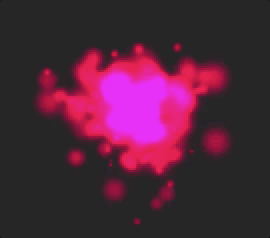
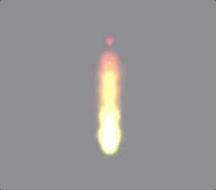
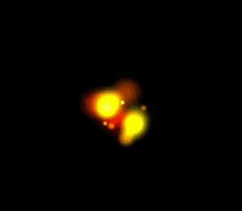
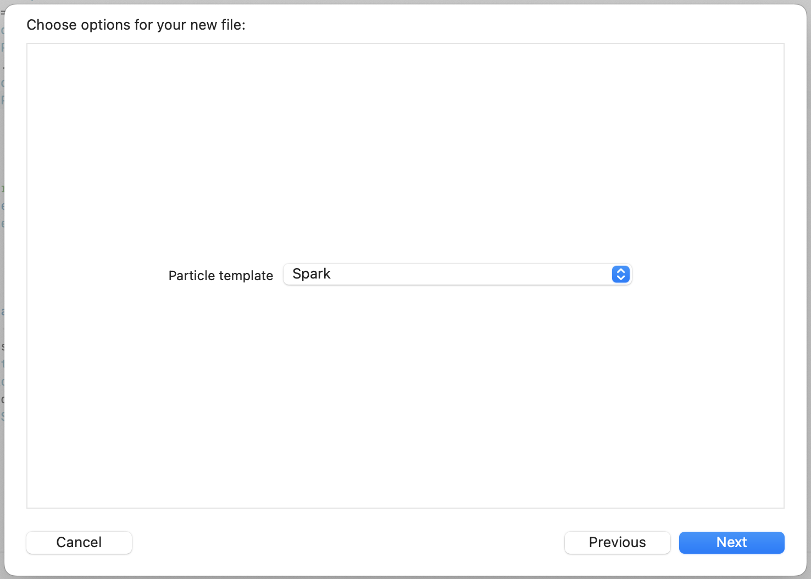
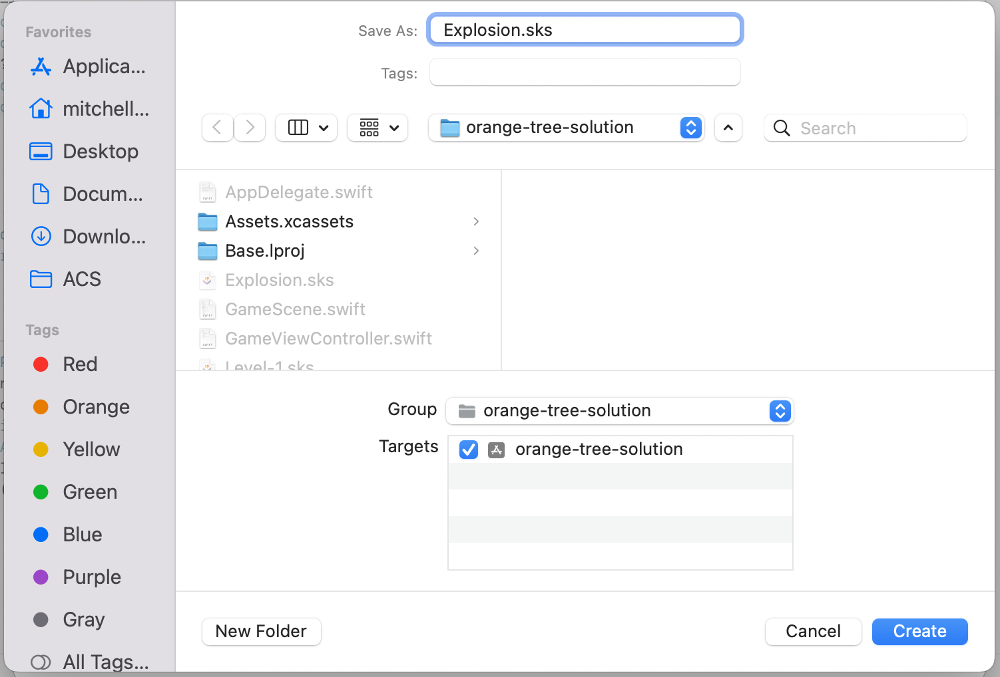
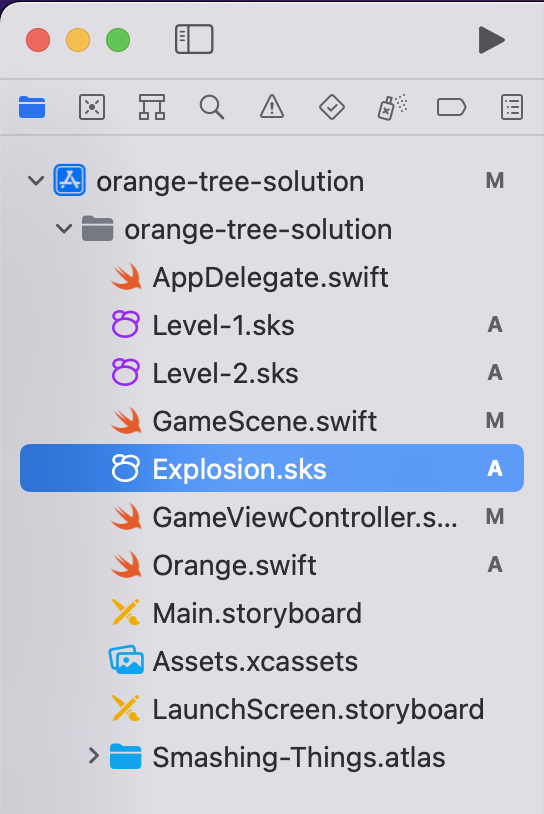
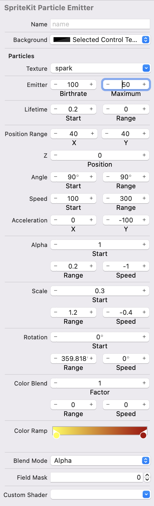

# Particles

The game is looking pretty good but it could be spiced up with some particle effects. Particle effects are used to create things like explosions, smoke, fire, trails, and other special effects that aren't game objects but add to the atmosphere of the game. 

A particle effect is made up of many little pictures that fly around the screen and disappear over time. The little images might change color and size as they move. They might fly in all directions or generally in one direction or be left behind another object. 

Here are some examples of particle effects.







SpriteKit has particles built in and it makes them very easy to use. You can even preview and edit particle effects in the Xcode IDE! 

> [action] In your Xcode project create a new particle. Choose File > New. In the iOS tab choose SpriteKit Particle file. You will need to scroll down and fins this in the list. 


> Click next and choose "Spark" from the menu. This is the image that will be used to make the particle. 



> Name your file "Explosion". 



Look for a new file in your file list named: "Explosion.sks"



Select it and you should see a preview of the particle effect in the editor. 

> [action] Adjust the particle effect by setting values in the property inspector. You can match the values I used or adjust these to what you like. You migth come back and change these later on after testing this in your game. 



You can make instances of this particle system using code! When a skull is desteoyed you generate a particle instance at the position of the skull. You also need to remove the particle instance after a short time. 

The best way to do this is with a function! This function can take a parameter `point` of type `CGPoint` and it can create the instance of "Explosion" at that point. 

To remove the explosion you can use an `SKAction`. `SKAction` is a class that does a lot of things. In this case you can use the "wait" action to wait a short time and then run some code to remove the particle. 

To keep our code organized we can put this new function inside a class extension. 

> [action] At the bottom of *GameScene.swift*, below the all of the other code and outside the class, add a new extension. 

```Swift 
extension GameScene {
  func skullDestroyedParticles(point: CGPoint) {
      if let explosion = SKEmitterNode(fileNamed: "Explosion") {
        addChild(explosion)
        explosion.position = point
        let wait = SKAction.wait(forDuration: 1)
        let removeExplosion = SKAction.removeFromParent()
        explosion.run(SKAction.sequence([wait, removeExplosion]))
      }
    }
}
```

The code above adds an extension to the *GameScene* class. This extension constains a function which takes a single parmaeter `point` of type `CGPoint`.

If creates an instance of `SKEmitter` with the filenamed. The filename needs to match the name of the particle file you created earlier. 

If that was successful it adds the `explosion` as a child of the scene, sets it's position to the `point` passed to the function. 

Last it creates a `wait` action that waits for 1 second. Then it creates a remove action that will remove an element from the scene. Last you are "running" the action on the `explosion` as a sequence. The sequence runs the wait, then remove action. The end effect is that the action waits 1 second, and then removes the explosion. 

The last step is to create these particles. The function will create them but only if you call the function and provide it with a *CGPoint* where the particle should appear. 

The way the physics engine works it provides us with the two bodies that collided lets call these *bodyA* and *bodyB*. In this game blocks, skulls, and the ground can collide, bodyA might any of these, and bodyB could any other. For example during one collision bodyA might be the skull and bodyB might be a block. In other collision bodyA might be a skull and bodyB could be a block. 

Since you are looking for skulls colliding you need to check both to see if either is a skull. 

> [action] Find the `didBegin(_ contact: SKPhysicsContact)` function. This is where your program gets notice that there was a collision. There is an if else block in this function. Change it to look like the code below. Notice that you are adding one new line in the if and the else blocks. 

```Swift
if nodeA?.name == "skull" {
	removeSkull(node: nodeA!)
	skullDestroyedParticles(point: nodeA!.position)
} else if nodeB?.name == "skull" {
	removeSkull(node: nodeB!)
	skullDestroyedParticles(point: nodeA!.position)
}
```

**Challenge!** Use the same idea here to remove the oranges from the scene. The oranges hang out for ever after they have been fired and the scene can be cluttered with them. You can create a new wait and remove action, and run that action on the oranges after they are fired to clean up the scene. 

## Summary

In this step you created a particle emitter and designed the particle system. Then you defined a function that creates the particles. It's important that you made the particles appear at the position of the skull. 

Particle add a lot to the game and start to make it look more professional! 
